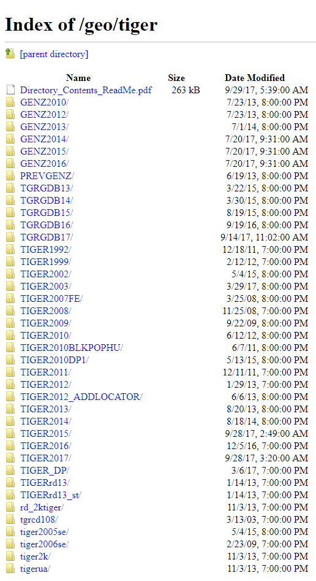
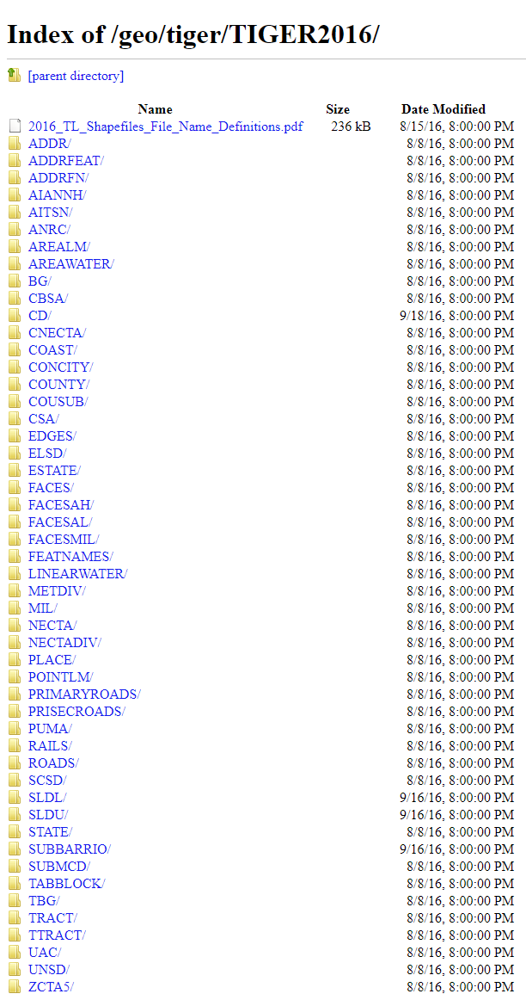

# Getting Started with Census Data: TIGER Services

This post will cover how to get started using the [TIGERweb Web Mapping Service API](https://tigerweb.geo.census.gov/tigerwebmain/TIGERweb_main.html).  TIGERweb is a REST API serviced by Census, but provisioned by ESRI.  This post will also cover how to download [TIGER/Line shapefiles ](https://ftp2.census.gov/geo/tiger) and convert them to GeoJSON.


### What You Will Learn

In this tutorial, we will learn how to use Census' services to get boundary files to match up with our statistical data.

These boundary files allow users to create maps with Census data. While we will not cover how to connect your data to these shapes in this tutorial (as how you might do this depends on your technology stack), we will be covering how to navigate through the various Census services to find and retrieve what you need. We will be covering some technology specific means of connecting data to geographic boundaries in future tutorials.

## The TIGERweb Web Mapping Service (WMS)

Census also provides an [API](https://tigerweb.geo.census.gov/tigerwebmain/TIGERweb_wms.html) that allows you to get geographic boundaries in a variety of formats:

- HTML (Hypertext Markup Language)
- JSON (JavaScript Object Notation)
- GeoJSON (Geographic JavaScript Object Notation)
- KMZ (Keyhole Markup language Zipped)
- AMF (Area Master File)

However, since boundaries - unlike statistics - can be a huge request even for a small selection of geographies (think in terms of MB rather than KB) this service should only be used if you have a very specific need. Some use cases where using the WMS would make sense would be:

1. if you have specialty area/shape and would like to get a nested set of Census areas within it
2. if you can't find a shapefile translation service to get the files into a format you can use that is listed above
3. if you're creating an application that only needs a small number of geographies and want to make the requests programmatically

Otherwise, you are probably better off using FTP to download the shapes, translating to your preferred format for storage in your own mapping server or third party service (e.g., Leaflet.js, CartoDB, MapBox, etc.).

### Finding the Specific Endpoint for an API Call

Go to the  [TIGERweb homepage](https://tigerweb.geo.census.gov/tigerwebmain/TIGERweb_wms.html) and from there, you'll want to choose the [WMS tab](https://tigerweb.geo.census.gov/tigerwebmain/TIGERweb_wms.html) right below the "TIGERweb" header.

We're looking for the 2016 data, so - from the left navigation pane - click on the [ACS 2016](https://tigerweb.geo.census.gov/arcgis/rest/services/TIGERweb/tigerWMS_ACS2016/MapServer) link. You should see a long list of "Layers," from which you will choose your geographic level. In our case, this will be [States](https://tigerweb.geo.census.gov/arcgis/rest/services/TIGERweb/tigerWMS_ACS2016/MapServer/82) at the base of the list. If you scroll to the bottom of that page, you will find a link to [Query](https://tigerweb.geo.census.gov/arcgis/rest/services/TIGERweb/tigerWMS_ACS2016/MapServer/82/query). Click that.

#### The TIGERweb Query Builder


This is a generic query builder that ESRI provisions for all Feature Services such as the one used by Census. If you're like me - and not a GIS expert - these won't make any sense to you.

Not to worry! We only need to know how to use a couple of these parameters to do what we need:

| Parameter | Required? | Query (URL) Parameter | Example Argument |
| --- | --- | --- | --- |
| Where | `where` | Yes | `BASENAME = 'DELAWARE'` |
| Text | `text` |   |
| Object IDs | `objectIds` |  |
| Time | `time` |   |  |
| Input Geometry | `geometry` | Sometimes*  |   |
| Geometry Type | `geometryType` | yes | `esriGeometryEnvelope` |
| Input Spatial Reference | `inSR` |   |   |
| Spatial Relationship | `spatialRel` | yes | `esriSpatialRelIntersects` |
| Relation | `relationParam` |   |  |
| Out Fields | `outFields` |   |   |
| Return Geometry | `returnGeometry` | yes | `true` |
| Return True Curves | `returnTrueCurves` | yes | `false` |
| Max Allowable Offset | `maxAllowableOffset` |   |   |
| Geometry Precision | `geometryPrecision` |   |   |
| Output Spatial Reference | `outSR` |   |   |
| Return IDs Only | `returnIdsOnly` | yes | `false` |
| Return Count Only | `returnCountOnly` | yes | `false` |
| Order By Fields | `orderByFields` |   |   |
| Group By Fields (For Statistics) | `groupByFieldsForStatistics`  |   |   |
| Output Statistics | `outStatistics` |   |   |
| ReturnZ | `returnZ` | yes | `false` |
| ReturnM | `returnM` | yes | `false`  |
| Geodatabase Version Name | `gdbVersion` |   |   |
| Return Distinct Values | `returnDistinctValues` | yes | `false` |  
| Result Offset | `resultOffset` |   |   |
| Result Record Count | `resultRecordCount` |   |   |
| Format | `f` | yes | `geojson` |

Let us say for example that we wanted to retrieve the geometries for Virginia, Maryland and the District of Columbia in GeoJSON format. **The only parameters we will alter in this query builder would be:**

- `where` = `BASENAME = ‘Maryland’ OR BASENAME = ‘Virginia’ OR BASENAME = ‘District of Columbia’`
- `f` (format) = `geojson`

**Everything else we leave as defaults.**

You can find out more about the parameters in the [ArcGIS Documentation](http://resources.arcgis.com/en/help/arcgis-rest-api/#/Query_Feature_Service_Layer/02r3000000r1000000/) provided by ESRI. Also, again, feel free to reach out via the contacts at the bottom of this post!

### Making Our First TIGERweb API Call

So, after all that, here's what our States request translates into a RESTful query:
```
https://tigerweb.geo.census.gov/arcgis/rest/services/TIGERweb/tigerWMS_ACS2016/MapServer/82/query?where=1%3D1&text=&objectIds=&time=&geometry=&geometryType=esriGeometryEnvelope&inSR=&spatialRel=esriSpatialRelIntersects&relationParam=&outFields=&returnGeometry=true&returnTrueCurves=false&maxAllowableOffset=&geometryPrecision=&outSR=&returnIdsOnly=false&returnCountOnly=false&orderByFields=&groupByFieldsForStatistics=&outStatistics=&returnZ=false&returnM=false&gdbVersion=&returnDistinctValues=false&resultOffset=&resultRecordCount=&f=geojson
```

The response for this request is located in the repo [here](./assets/shapes/2016-states-API-request.geojson).

#### * = Using the API to Get Boundaries within A User Defined Area

If you have an area you would like to return a specific set of nested or overlapping Census boundaries for, the API is the way to go. The only challenge with this is that this parameter requires the argument to be in one of the specific formats as defined by ESRI in their [Documentation](http://resources.arcgis.com/en/help/arcgis-rest-api/#/Query_Feature_Service_Layer/02r3000000r1000000/):

> Description: The geometry to apply as the spatial filter. The structure of the geometry is the same as the structure of the json geometry objects returned by the ArcGIS REST API. In addition to the JSON structures, for envelopes and points, you can specify the geometry with a simpler comma-separated syntax.
>
>Syntax:
>
> - JSON structures: `geometryType=<geometryType>&geometry={geometry}`
> - Envelope simple syntax: `geometryType=esriGeometryEnvelope&geometry=<xmin>,<ymin>,<xmax>,<ymax>`
> - Point simple syntax: `geometryType=esriGeometryPoint&geometry=<x>,<y>`
>
>Examples:
>
> - `geometryType=esriGeometryEnvelope&geometry={xmin: -104, ymin: 35.6, xmax: -94.32, ymax: 41}`
> - `geometryType=esriGeometryEnvelope&geometry=-104,35.6,-94.32,41`
> - `geometryType=esriGeometryPoint&geometry=-104,35.6`

The good news is that ESRI also created a library, which allows JavaScript developers to translate multiple geo formats into the required format. The [terraformer](http://terraformer.io/) library also contains a number of other helper functions that "does stuff to your data so you can map gooder."

However, this functionality is outside the scope of this tutorial. We may do a tutorial on this in the future if there's an obvious demand. Hit us up on twitter to tell us what you want us to cover in future tutorials: [@uscensusbureau](https://twitter.com/uscensusbureau).

## The TIGER/Line FTP website

For general purposes (e.g., creating maps using Census data and geographies), users are encouraged to download shapefiles via FTP from [Census' FTP site for TIGER files](https://ftp2.census.gov/geo/tiger). Boundary files are very large. As such, requesting them via API can not only be prohibitive (timeouts due to large requests), but can also be impractical in terms of performance for production-ready applications.

We'll cover how to navigate this FTP site and get the boundaries for our data (2016 vintage states and territories).

### Step 1. Getting the Right Vintage of boundaries

From [Census' FTP site for TIGER files](https://ftp2.census.gov/geo/tiger), scan down to find the 2016 vintage `TIGER2016`.



This will get us a list of available layers (although somewhat cryptically).



If you're having a hard time finding the file which corresponds to the geographic resolution you need, first review the section on Geographies in the intro tutorial and - if you're still having troubles - please reach out via the contact info below and we will be happy to assist you.

In our case, we're looking for states, i.e., the `STATE/` file. Follow the link and click the file located therein to begin your download.

### Step 2. Translating the Shapefile into GeoJSON

In catering to the broadest audience with this tutorial, we're choosing an open standard to translate the files into. Other formats are supported by the following service and other services, depending upon your needs.

The service we will be using is a free service provided by [AcuGIS](https://www.acugis.com/). Thank you for your public service AcuGIS!

Go to [http://2geojson.com/index.php](http://2geojson.com/index.php).

All you have to do here is click the "Choose File" button, select your file and leave all the other fields as default/blank. This is a server-side service, so be patient as the file is uploaded and converted. Once it's converted you'll see a green dialog alert that allows you to "Click Here to DownLoad."

There was a little hiccup when I made this translation, which you may run into when you do your conversion that there was an extra new line at the top and another the bottom of the data that you'll need to remove... free ain't free ;).

You might also find - like I did - that larger .geojson files might crash your text editor (Atom, in my case). Sublime text worked for me for this purpose.

For your convenience, I've included the resulting translation in the [assets/shapes folder](./assets/shapes/2016-states.geojson) of this repo where you should be able to see the shapes rendered in github or you can use a third-party web viewer to verify yours at [mapshaper.org](http://mapshaper.org/).

## Summary

You've learned how to get geographic boundaries for generating maps with your data. Congratulations! It wasn't easy, but it will be rewarding if you use it for good :)

#### Contact
If you have any questions, need any assistance or run into *any* problems along your learning path, please reach out on Census' [gitter channel](https://gitter.im/uscensusbureau/home) or reach out via email at [cnmp.developers.list@census.gov](mailto:cnmp.developers.list@census.gov). Users have found the Census staff helpful and responsive.
<!--stackedit_data:
eyJoaXN0b3J5IjpbLTE2NTI5MzUwNzEsLTE1ODE4NTI3OTFdfQ
==
-->
